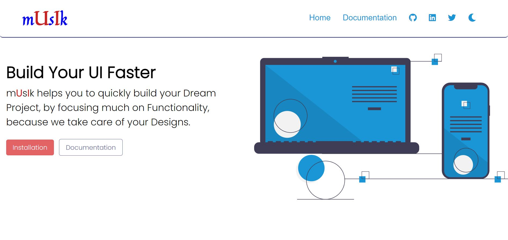

## mUsIk - Component Library

<div align="center">



mUsIk is an open source styling framework, which helps Developers to use best styles and components, by using pre-defined classnames. It helps you to quickly build your Dream Project, by focusing more on Functionality, because we take care of your Designs. You need not have to start building everything from scratch, we have got your design covered. 
  
</div>

---

## Live Website: [mUsIk](https://musik-cl.netlify.app/index.html)

---

## Installation

In order to introduce mUsIk to your project, copy the link given below and paste it in the < head > tag of your html, above all other style sheets. You can also import the library in your CSS file. 

```html
<link rel="stylesheet" href="https://musik-cl.netlify.app/styles.css" />
```

```css
@import url("https://musik-cl.netlify.app/styles.css");
```
### Components

You can view all the Components [here](https://musik-cl.netlify.app/pages/getting-started/usage/usage.html)

- [Avatar](#avatar)
- [Badge](#badge)
- [Alert](#alert)
- [Button](#button)
- [Card](#card)
- [Image](#image)
- [Input](#input)
- [Typography](#typography)
- [Lists](#lists)
- [Rating](#rating)

---

### Avatar

Avatars can be used as a graphical representation of a person through a profile picture or image, an icon, or a text with initials.

We provide 3 types of avatars: 

- Profile Avatar
- Square Avatar
- Text Avatar

Check out: https://musik-cl.netlify.app/pages/components/avatar/avatar.html

---

### Badge

Badges are being used to display a notification count or status(online / offline / away) information.

We provide 3 variants of badges: 

- Status Badge
- Status Badge with Icon
- Text Badge

Check out: https://musik-cl.netlify.app/pages/components/badge/badge.html

---

### Alert

Alerts are convey important message that attracts user's attention without interrupting the user's flow of work. mUsIk provides alerts with and without close buttons too. We cover the following types of Alert:

- Primary Alert
- Secondary Alert
- Success Alert
- Warning Alert
- Danger Alert

Check out: https://musik-cl.netlify.app/pages/components/alert/alert.html

---

### Button

Buttons are also called as call to action. We have range of buttons and their states. You may use a tag or button element, you need to add respective classes, and you are good to go.

- Primary Buttons
- Secondary Buttons
- Disabled Buttons
- Sized Buttons
- Toggle & Floating Buttons

Check out: https://musik-cl.netlify.app/pages/components/button/button.html

---

### Card

Cards are used to show user related data collectively, like product details. It may contain call-to-action buttons, some important data, etc.

mUsIk provides 3 different card variants: 

- Horizontal Card with Badge
- Vertical Card with Badge
- Card with Dismiss
- Card with Shadow
- Card with Text Overlay
- Card with only Text

Check out: https://musik-cl.netlify.app/pages/components/card/card.html

---

### Image

The images provided take the full width of the container and are responsive in nature.

We have 2 types of images: 

- Responsive Image
- Round Image

Check out: https://musik-cl.netlify.app/pages/components/image/image.html

---

### Input

Used to get user input, it may be a sinlge input or a collection of inputs inside a form.

mUsIk provides the following input variants:

- Textbox
- Simple Input
- Input with Label
- Input Error
- Input Required Validation

Check out: https://musik-cl.netlify.app/pages/components/input/input.html

---
### Typography

It contains various text utilities.

- Heading Text
- Aligned Text
- Paragraph Text
- Extra Text Styles

Check out: https://musik-cl.netlify.app/pages/components/typography/typography.html

---

### Lists

Lists are used everywhere, they represent continuous and related data. 

mUsIk provides the following types of Lists:

- Unordered List with Bullets
- Ordered List with Bullets
- List without Bullets
- Stacked List
- Simple List Group
- Select List Group

Check out: https://musik-cl.netlify.app/pages/components/list/list.html

---

### Rating

Ratings are a great way to get user feedback and opinion on your work. 

We provide 2 types of ratings: 

- View only Rating
- Input Rating

Check out: https://musik-cl.netlify.app/pages/components/rating/rating.html

---


## **Issue Reporting**
Encountered a bug or have a feature request ? Please do check the issues tab for existing and closed issue / request. If it does not exist, [please open a new issue](https://github.com/Omkar-Ghate/musik/issues).

## **Author**
<hr>
Let's connect: 

[](https://www.linkedin.com/in/omkarghate/) 
[](https://twitter.com/OmkarGhate9)
